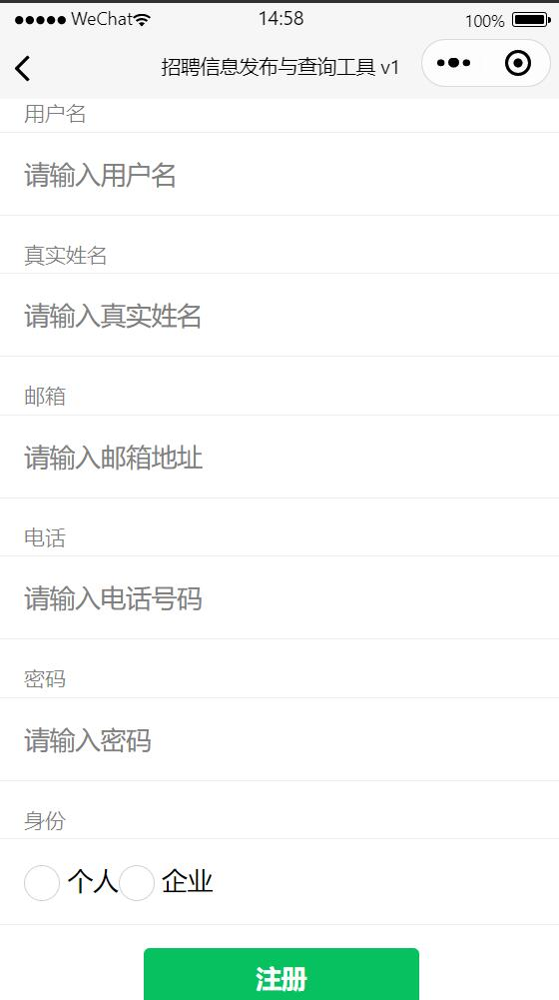
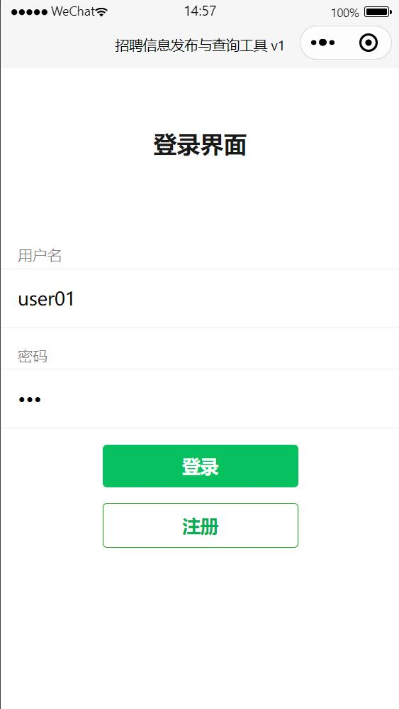
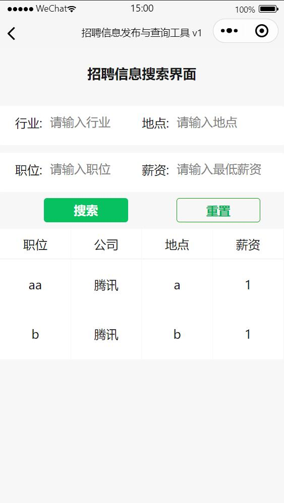
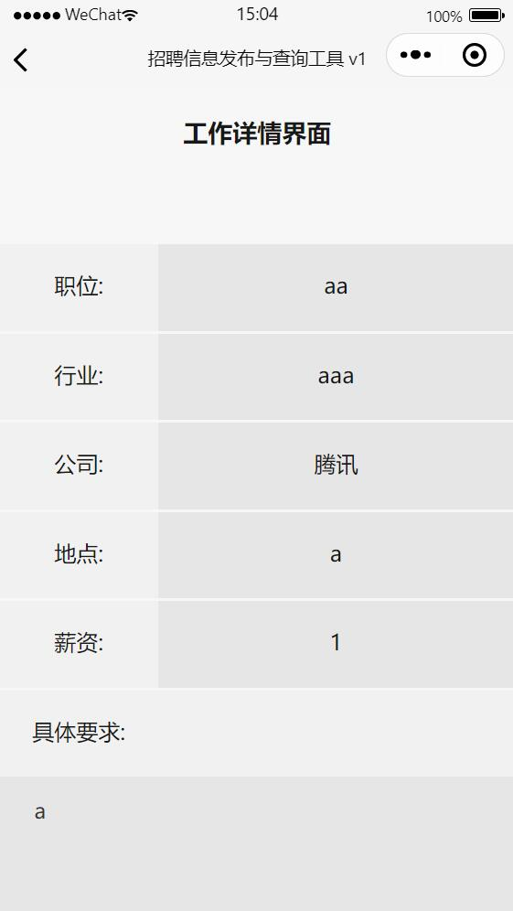

招聘信息发布工具项目报告

一、应用场景分析

​       在乡村建设过程中，优质人才资源外流、人才结构失衡等问题日益凸显，乡村新业态的蓬勃发展、乡村集体产业的转型增值，迫切需要各类专业人才的加入。本小程序对接家乡人才需求，传递给在外的学子，或者想返乡的创业的人，以及当地想找工作的人。通过简单易用的招聘信息发布与搜索工具，帮助乡村吸引人才。

二、拟实现功能

支持帐号登录体系，帐号登录、登出等；

招工信息查询，可选择职位、薪酬待遇、行业类别、工作地点等；

招工需求发布，可区分个人或企业身份，并能编辑相关用工信息；

求职信息发布，个人可编辑相关求职信息发布；

简历投递，可向心仪的招工企业或个人雇主投递简历；

简单管理端，企业或个人雇主可对收到的求职信息进行处理，如简历查看，对信息打标记等。

三、技术介绍

小程序前端通过wxml以及wxss设计界面，后端使用微信云开发的云函数实现与数据库的交互。

四、功能展示与使用方法

第一次迭代：

1. 账号注册与登录：

在登录界面输入用户名和密码即可登录，账号分为个人账号与企业账号两种，在登陆之后会进入到个人版主页或企业版主页。个人版主页可以进入到查询招聘信息页面，企业版主页可以进入到招聘信息发布页面。

在注册页面中，用户需要填写个人信息以及注册账号的类别，若为企业账号还需填写企业名称。

2. 招聘信息发布：

企业账号可以发布招聘信息，需要填写行业、岗位、工作地点、薪资以及具体要求，点击提交即可将招聘信息发布到数据库中。

3. 招聘信息查询：

个人账号可以查询数据库中的招聘信息，并且可以输入行业、地点、职位或最低薪资来搜索符合条件的招聘信息。

 

第二次迭代：

4. 招聘信息详情页：

个人账号可点击招聘信息查询页面显示的岗位信息，进入到详情页面，详情页面有关于岗位更详细的信息以及岗位的具体要求。

5. 求职信息发布：

个人账号可以发布求职信息，填写自身的情况、求职的岗位以及预期的薪水，点击提交即可将求职信息发布到数据库中。

6. 求职信息查询：

企业用户可以查询数据库中的求职信息，并且可以输入行业、地点、职位或最低薪资来搜索符合条件的求职信息。
