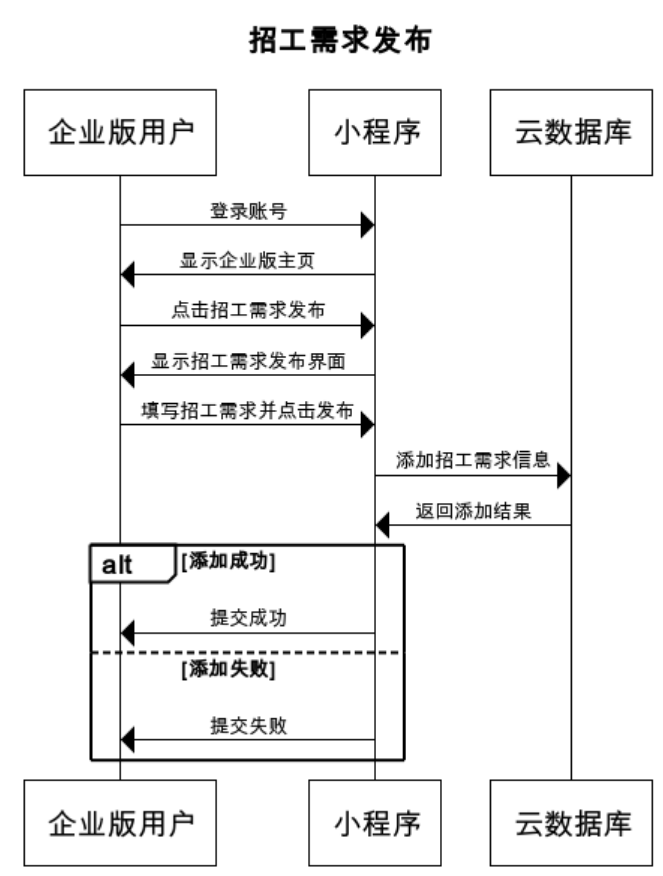
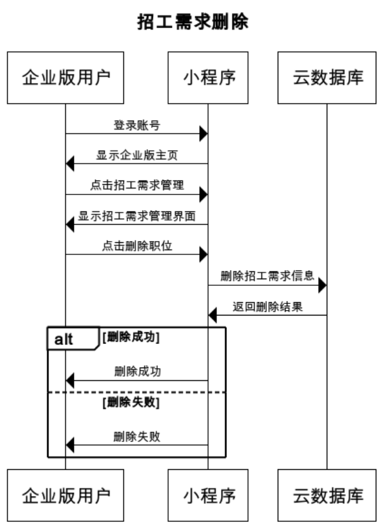

# 招聘信息发布工具项目报告

## 一、应用场景分析

​       在乡村建设过程中，优质人才资源外流、人才结构失衡等问题日益凸显，乡村新业态的蓬勃发展、乡村集体产业的转型增值，迫切需要各类专业人才的加入。本小程序对接家乡人才需求，传递给在外的学子，或者想返乡的创业的人，以及当地想找工作的人。通过简单易用的招聘信息发布与搜索工具，帮助乡村吸引人才。

## 二、拟实现功能

支持帐号登录体系，帐号登录、登出等；

招工信息查询，可选择职位、薪酬待遇、行业类别、工作地点等；

招工需求发布，可区分个人或企业身份，并能编辑相关用工信息；

求职信息发布，个人可编辑相关求职信息发布；

简历投递，可向心仪的招工企业或个人雇主投递简历；

简单管理端，企业或个人雇主可对收到的求职信息进行处理，如简历查看，对信息打标记等。

## 三、具体功能

### （一）账号注册与登录

#### 1.功能说明

在登录界面输入用户名和密码即可登录，账号分为个人账号与企业账号两种，在登陆之后会进入到个人版主页或企业版主页。在注册页面中，用户需要填写个人信息以及注册账号的类别，若为企业账号还需填写企业名称。

#### 2.技术实现

通过小程序云开发之中的数据库存储用户账号信息。登录时通过使用wx.cloud.database()对象的collection().get()方法获取数据库中的信息。注册时使用wx.cloud.database()对象的collection().add()方法将新账号信息加入到数据库中。

#### 3.产品实现

### （二）招聘信息搜索与简历投递

#### 1.功能说明

个人版用户可以在招聘信息搜索界面通过行业、地点、职位、薪资来搜索招聘信息。在工作详情界面可以查看具体信息并且联系公司以及投递简历。

#### 2.技术实现

通过小程序云开发之中的数据库存储招聘信息，通过云开发存储功能存储简历文件。查找时通过使用wx.cloud.database()对象的collection().get()方法获取数据库中的信息。简历投递时使用wx.chooseMessageFile()函数实现文件获取，使用wx.cloud.uploadFile()函数实现文件上传。

#### 3.产品实现

### （三）求职信息发布与管理

#### 1.功能说明

个人版用户可以在求职信息发布界面填写具体求职信息并发布。在求职信息管理界面可以查看、修改或删除已发布的求职信息。

#### 2.技术实现

通过小程序云开发之中的数据库存储求职信息。发布时通过使用wx.cloud.database()对象的collection().add()方法将求职信息添加到数据库中。管理时通过使用wx.cloud.database()对象的collection().get()、collection().update()以及collection().remove()方法实现求职信息查看、更改与删除。

#### 3.产品实现

### （四）求职信息搜索

#### 1.功能说明

企业版用户可以在求职信息搜索界面通过行业、地点、职位、薪资来搜索求职信息。在求职信息详情界面可以查看具体信息并且联系求职者。

#### 2.技术实现

通过小程序云开发之中的数据库存储求职信息。查找时通过使用wx.cloud.database()对象的collection().get()方法获取数据库中的信息。

#### 3.产品实现

### （五）招工需求发布管理与简历管理

#### 1.功能说明

企业版用户可以在招工需求发布界面填写具体招工需求并发布。在招工需求管理界面可以查看、修改或删除已发布的招工需求，并且可以查看以及删除应聘者所投递的简历。

#### 2.技术实现

通过小程序云开发之中的数据库存储招聘信息。发布时通过使用wx.cloud.database()对象的collection().add()方法将招工需求信息添加到数据库中。管理时通过使用wx.cloud.database()对象的collection().get()、collection().update()以及collection().remove()方法实现招工需求的查看、更改与删除。通过wx.cloud.downloadFile()以及wx.openDocument()方法实现从云存储中下载简历文件并打开，通过wx.cloud.deleteFile()实现删除简历文件。

#### 3.产品实现

